# Map Reduce Tutorial

MapReduce is a software framework in Hadoop. It take an input and maps it to different nodes in our Hadoop setup.  Each node then does some processing on these files.  There is then a combine procedure that combines and reduces the result in an output.  The language used is Java but it doesn't have to be (see lecture notes). 

The code that does all this is shown below.  If you are familiar with Java and the concept of Object Oriented Programming, this may look understandable to you.  Otherwise, do not worry, we will simply use this as a tool to see what we can do with MapReduce

```
import java.io.IOException;
import java.util.StringTokenizer;

import org.apache.hadoop.conf.Configuration;
import org.apache.hadoop.fs.Path;
import org.apache.hadoop.io.IntWritable;
import org.apache.hadoop.io.Text;
import org.apache.hadoop.mapreduce.Job;
import org.apache.hadoop.mapreduce.Mapper;
import org.apache.hadoop.mapreduce.Reducer;
import org.apache.hadoop.mapreduce.lib.input.FileInputFormat;
import org.apache.hadoop.mapreduce.lib.output.FileOutputFormat;

public class WordCount {

  public static class TokenizerMapper
       extends Mapper<Object, Text, Text, IntWritable>{

    private final static IntWritable one = new IntWritable(1);
    private Text word = new Text();

    public void map(Object key, Text value, Context context
                    ) throws IOException, InterruptedException {
      StringTokenizer itr = new StringTokenizer(value.toString());
      while (itr.hasMoreTokens()) {
        word.set(itr.nextToken());
        context.write(word, one);
      }
    }
  }

  public static class IntSumReducer
       extends Reducer<Text,IntWritable,Text,IntWritable> {
    private IntWritable result = new IntWritable();

    public void reduce(Text key, Iterable<IntWritable> values,
                       Context context
                       ) throws IOException, InterruptedException {
      int sum = 0;
      for (IntWritable val : values) {
        sum += val.get();
      }
      result.set(sum);
      context.write(key, result);
    }
  }

  public static void main(String[] args) throws Exception {
    Configuration conf = new Configuration();
    Job job = Job.getInstance(conf, "word count");
    job.setJarByClass(WordCount.class);
    job.setMapperClass(TokenizerMapper.class);
    job.setCombinerClass(IntSumReducer.class);
    job.setReducerClass(IntSumReducer.class);
    job.setOutputKeyClass(Text.class);
    job.setOutputValueClass(IntWritable.class);
    FileInputFormat.addInputPath(job, new Path(args[0]));
    FileOutputFormat.setOutputPath(job, new Path(args[1]));
    System.exit(job.waitForCompletion(true) ? 0 : 1);
  }
}
```

Now we need to compile this could and at a minimum we require a compiler.  But given the complexity of this code, we need more support and will use a Integrated Development Environment or IDE.  For this particular tutorial we will not be modifying the default code but we will in the future so it's best we download an IDE.

In Java, the most commonly used is the Eclipse IDE.  We would like to download the IDE, go to http://www.eclipse.org/downloads/packages/

There are many choices here - it seems confusing but in reality it is just a an alphabetical list.  I found it funny that a developers <a href="https://kichwacoders.com/2016/04/28/why-its-time-to-kill-the-eclipse-release-namesneon-oxygen-etc/">bemoans</a> all the different choices, but it's not surprising too many choices can lead to <a href="https://www.youtube.com/watch?v=VO6XEQIsCoM">paralysis</a>.  Choose the Oxygen version (Photon is a bit underdeveloped at this point) as shown below: 

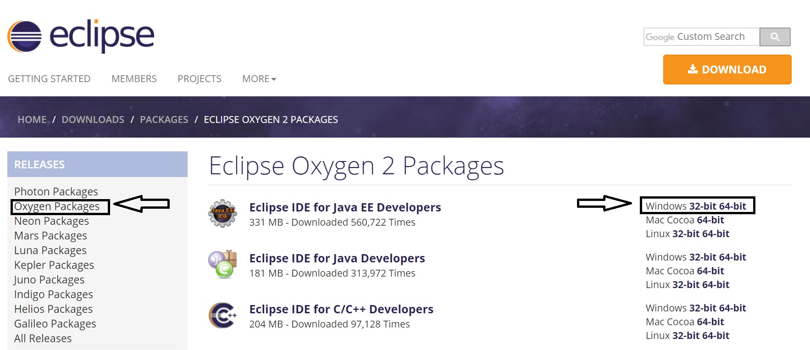

Open Eclipse

Choose a project directory (can be the default chosen for you)

In the next window choose File --> New Project

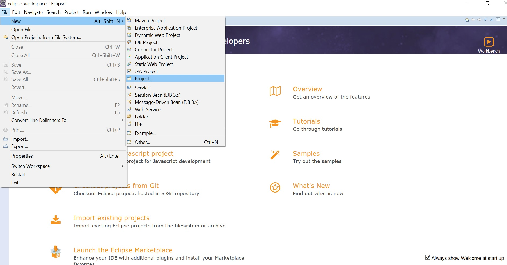

Choose Java Project, and call the project WordCount

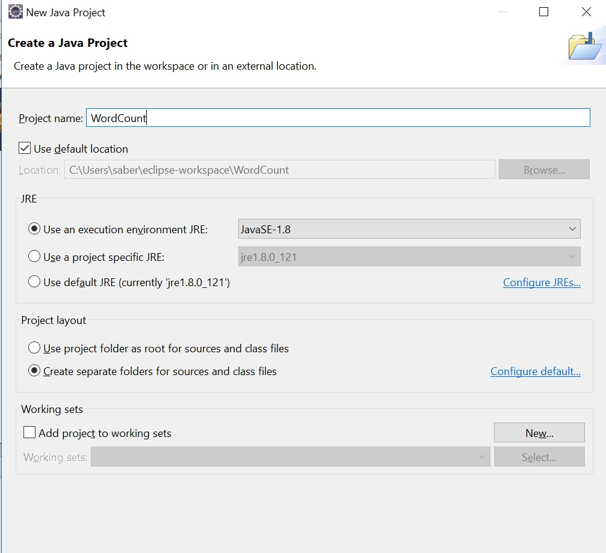

Click Next.

We now need to add the hadoop libraries.

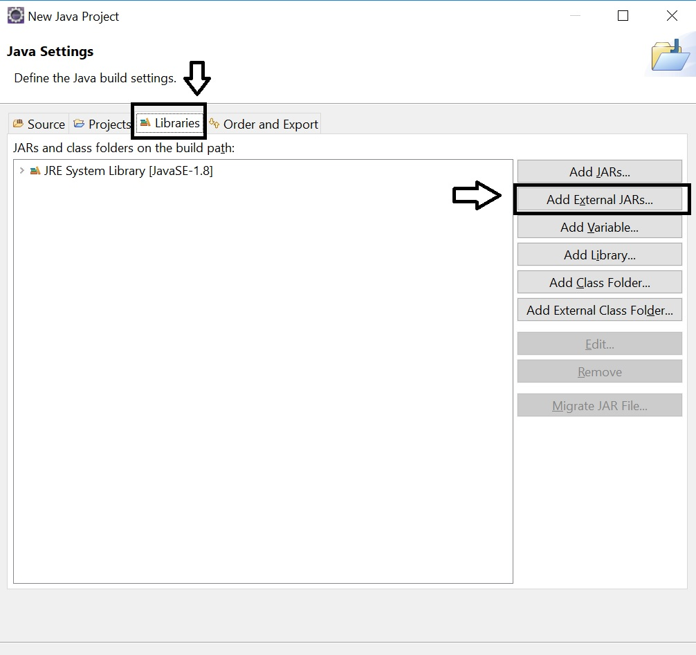

You should have already downloaded Hadoop 2.9 version for installing the Hadoop cluster on a single node.  The files were untarred (equivalent to unzipped) in the following folder on your virtual machine

```
/usr/local/hadoop/share/hadoop/common
```

But since we are installing Eclipse on the windows/mac platform, we cannot "see" these files.  One way is to access the files is to create a shared folder for your virtual machine and native OS. Easier solution is to download the file from the course website.

We now need to add the MapReduce core library, it is located in

```
/usr/local/hadoop/share/hadoop/common
```

You can access it from this folder, or download it from the course website.

Click the Finish botton.

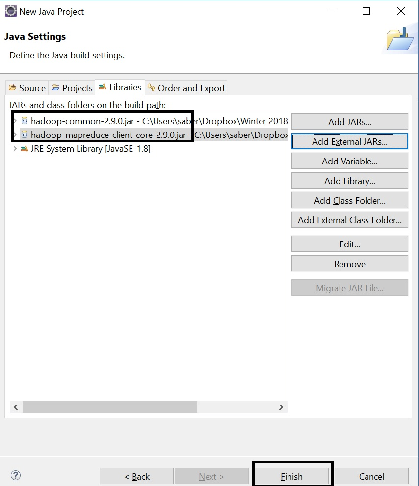

In the Project development environment, right click on src --> New --> Class

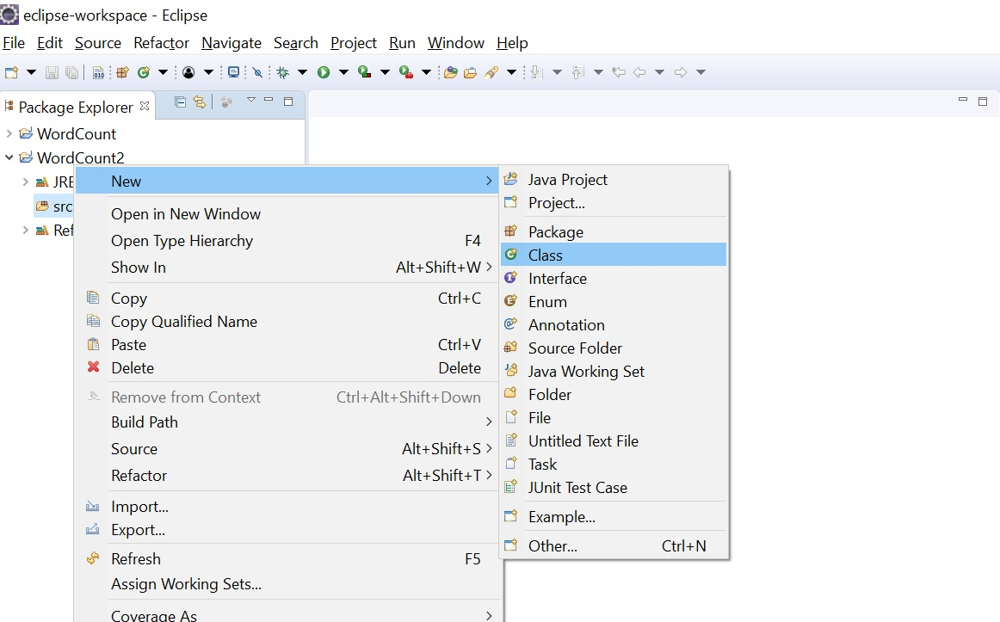

Call the new class "WordCount" and click finish.

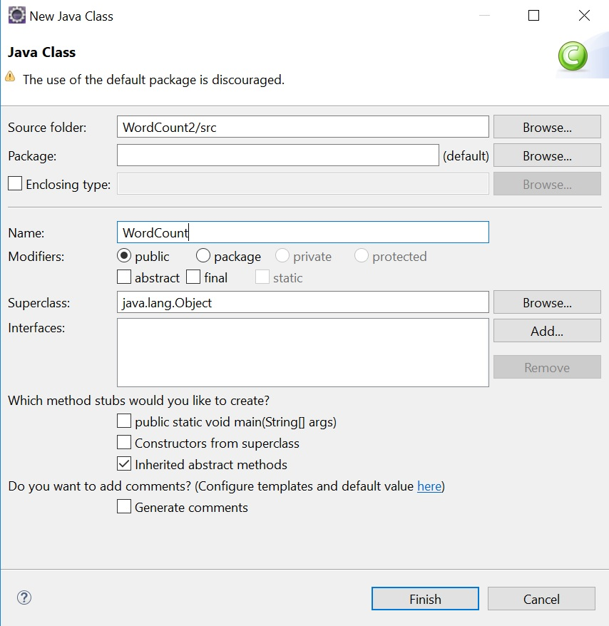

Now copy the mapper and reducer functions as written in Java:

```
import java.io.IOException;
import java.util.StringTokenizer;

import org.apache.hadoop.conf.Configuration;
import org.apache.hadoop.fs.Path;
import org.apache.hadoop.io.IntWritable;
import org.apache.hadoop.io.Text;
import org.apache.hadoop.mapreduce.Job;
import org.apache.hadoop.mapreduce.Mapper;
import org.apache.hadoop.mapreduce.Reducer;
import org.apache.hadoop.mapreduce.lib.input.FileInputFormat;
import org.apache.hadoop.mapreduce.lib.output.FileOutputFormat;

public class WordCount {

  public static class TokenizerMapper
       extends Mapper<Object, Text, Text, IntWritable>{

    private final static IntWritable one = new IntWritable(1);
    private Text word = new Text();

    public void map(Object key, Text value, Context context
                    ) throws IOException, InterruptedException {
      StringTokenizer itr = new StringTokenizer(value.toString());
      while (itr.hasMoreTokens()) {
        word.set(itr.nextToken());
        context.write(word, one);
      }
    }
  }

  public static class IntSumReducer
       extends Reducer<Text,IntWritable,Text,IntWritable> {
    private IntWritable result = new IntWritable();

    public void reduce(Text key, Iterable<IntWritable> values,
                       Context context
                       ) throws IOException, InterruptedException {
      int sum = 0;
      for (IntWritable val : values) {
        sum += val.get();
      }
      result.set(sum);
      context.write(key, result);
    }
  }

  public static void main(String[] args) throws Exception {
    Configuration conf = new Configuration();
    Job job = Job.getInstance(conf, "word count");
    job.setJarByClass(WordCount.class);
    job.setMapperClass(TokenizerMapper.class);
    job.setCombinerClass(IntSumReducer.class);
    job.setReducerClass(IntSumReducer.class);
    job.setOutputKeyClass(Text.class);
    job.setOutputValueClass(IntWritable.class);
    FileInputFormat.addInputPath(job, new Path(args[0]));
    FileOutputFormat.setOutputPath(job, new Path(args[1]));
    System.exit(job.waitForCompletion(true) ? 0 : 1);
  }
}
```

Paste the entire above code in WordCount.java

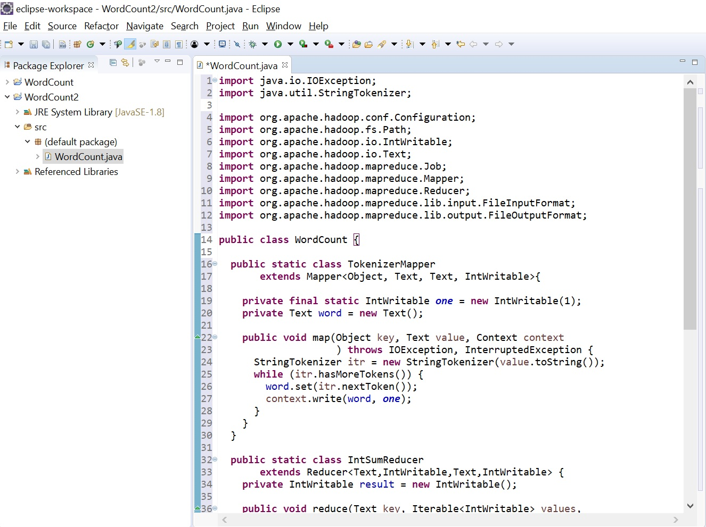

Save this file (we will use it in a future tutorial).

## Running a MapReduce job on your single node cluster

Boot up your virtual machine with a single node cluster and log in as hduser.

We need to first set up another environment variable

> export HADOOP_CLASSPATH=$JAVA_HOME/lib/tools.jar

Next, we need to save our code to a file:

> gedit WordCounter.java

On the text editor that opens, copy and paste the code that is shown above.

At the console, now compile your code:

> hadoop com.sun.tools.javac.Main WordCounter.java

This will create several class files.  You can see these by typing "ls" and seeing the files created:

```
hduser@HadoopNode:~$ ls
Desktop           Music      WordCount.class
Documents         Pictures   WordCount$IntSumReducer.class
Downloads         Public     WordCount.java
examples.desktop  Templates  WordCount$TokenizerMapper.class
hadoop_data       Videos
```

We will now take all the class files that were produced and package them into a jar file.

> jar cf WordCount.jar WordCount*.class

If you type "ls" again, you should see a file called WordCount.jar (it should be in red)

Make an input directory for our job.

> hdfs dfs -mkdir /input

If you get an error, try starting your HDFS as discussed in the Working with Hadoop Tutorial.

We now need a file to parse using MapReduce.  There is a file called alice.txt posted on the course website.  Download this file to your directory where you are running your commands (you can check the directory you are in by typing pwd or present working directory).

Now take this file and copy it to your HDFS.

> hdfs dfs -copyFromLocal alice.txt /input/alice.txt

Display the results to make sure the save occured correctly:

> hdfs dfs -ls /input

Should something similar to :
```
Found 1 items
-rw-r--r--   1 hduser supergroup         42 2018-02-17 17:08 /input/alice.xt
```

Now run the job

> hadoop jar WordCount.jar WordCount /input /output

Look at the log of the output to make sure there is no errors.  You should see something like the following:
```
hduser@HadoopNode:~$ hadoop jar WordCount.jar WordCount /input /output
18/02/27 21:27:01 INFO client.RMProxy: Connecting to ResourceManager at /0.0.0.0:8032
18/02/27 21:27:03 WARN mapreduce.JobResourceUploader: Hadoop command-line option parsing not performed. Implement the Tool interface and execute your application with ToolRunner to remedy this.
18/02/27 21:27:03 INFO input.FileInputFormat: Total input files to process : 1
18/02/27 21:27:03 INFO mapreduce.JobSubmitter: number of splits:1
18/02/27 21:27:04 INFO Configuration.deprecation: yarn.resourcemanager.system-metrics-publisher.enabled is deprecated. Instead, use yarn.system-metrics-publisher.enabled
18/02/27 21:27:04 INFO mapreduce.JobSubmitter: Submitting tokens for job: job_1519781659193_0002
18/02/27 21:27:05 INFO impl.YarnClientImpl: Submitted application application_1519781659193_0002
18/02/27 21:27:05 INFO mapreduce.Job: The url to track the job: http://HadoopNode:8088/proxy/application_1519781659193_0002/
18/02/27 21:27:05 INFO mapreduce.Job: Running job: job_1519781659193_0002
18/02/27 21:27:23 INFO mapreduce.Job: Job job_1519781659193_0002 running in uber mode : false
18/02/27 21:27:23 INFO mapreduce.Job:  map 0% reduce 0%
18/02/27 21:27:34 INFO mapreduce.Job:  map 100% reduce 0%
18/02/27 21:27:45 INFO mapreduce.Job:  map 100% reduce 100%
18/02/27 21:27:46 INFO mapreduce.Job: Job job_1519781659193_0002 completed successfully
18/02/27 21:27:46 INFO mapreduce.Job: Counters: 49
	File System Counters
		FILE: Number of bytes read=49
		FILE: Number of bytes written=403061
		FILE: Number of read operations=0
		FILE: Number of large read operations=0
		FILE: Number of write operations=0
		HDFS: Number of bytes read=143
		HDFS: Number of bytes written=27
		HDFS: Number of read operations=6
		HDFS: Number of large read operations=0
		HDFS: Number of write operations=2
	Job Counters 
		Launched map tasks=1
		Launched reduce tasks=1
		Data-local map tasks=1
		Total time spent by all maps in occupied slots (ms)=8372
		Total time spent by all reduces in occupied slots (ms)=8024
		Total time spent by all map tasks (ms)=8372
		Total time spent by all reduce tasks (ms)=8024
		Total vcore-milliseconds taken by all map tasks=8372
		Total vcore-milliseconds taken by all reduce tasks=8024
		Total megabyte-milliseconds taken by all map tasks=8572928
		Total megabyte-milliseconds taken by all reduce tasks=8216576
	Map-Reduce Framework
		Map input records=8
		Map output records=8
		Map output bytes=72
		Map output materialized bytes=49
		Input split bytes=101
		Combine input records=8
		Combine output records=4
		Reduce input groups=4
		Reduce shuffle bytes=49
		Reduce input records=4
		Reduce output records=4
		Spilled Records=8
		Shuffled Maps =1
		Failed Shuffles=0
		Merged Map outputs=1
		GC time elapsed (ms)=459
		CPU time spent (ms)=1820
		Physical memory (bytes) snapshot=361787392
		Virtual memory (bytes) snapshot=3902402560
		Total committed heap usage (bytes)=170004480
	Shuffle Errors
		BAD_ID=0
		CONNECTION=0
		IO_ERROR=0
		WRONG_LENGTH=0
		WRONG_MAP=0
		WRONG_REDUCE=0
	File Input Format Counters 
		Bytes Read=42
	File Output Format Counters 
		Bytes Written=27
```

Open a webbroswer and type the following address:

> http://localhost:8088

This is where you can take a look at the jobs in your cluster.  You should see a list of your jobs and whether they were successful or not.

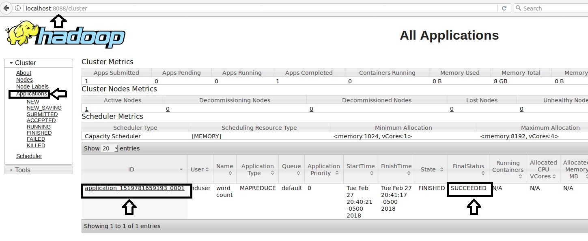

You can also look at your HDFS file system.  Go to http://localhost:50070 and click on Utilities-> Brows the file system.  You should see an output folder created.

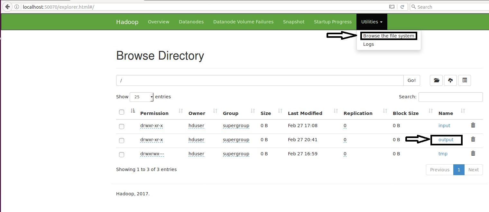

If you click on the output folder, you will see a file called SUCESS and another file which is our output (that we will look at next).

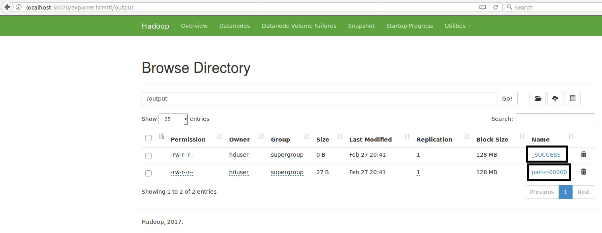

Now take a look at what you have got.

> hadoop fs -cat /output/part-r-00000

You should see a list of words and the number of occurences.  For the text file provided to you, the <i>beginning</i> of the output should look like this:

```
"'	1
"'TIS	1
"'Tis	1
"--SAID	1
"Come	1
"Coming	1
"Edwin	1
"French,	1
"HOW	1
"He's	1
"How	1
"I	8
"I'll	2
"Keep	1
"Let	1
"Such	1
"THEY	1
"There	2
"There's	1
"Too	1
"Turtle	1
"Twinkle,	1
"Uglification,"	1
"Up	1
"What	2
"Who	1
"William	1
"With	1
"YOU	1
"You	2
"come	1
"it"	2
"much	1
"poison"	1
"purpose"?'	1
'em	3
'tis	2
(Alice	4
(And,	1
(As	1
(Before	1
(Dinah	1
(For,	1
(He	1
(I	1
(IF	1
(In	1
(It	1
(Sounds	1
(The	3
(WITH	1
(We	1
(Which	2
(`I	1
(`That's	1
(`the	1
(`which	1
(a	1
(and	1
(as	2
(for	1
(for,	1
(it	4
(look	1
(luckily	1
(not	1
(or	1
(pointing	1
(she	9
(the	1
(though	1
(when	1
(which	1
(with	1
*	60
```

## Debugging Issues

> yarn application -list

> yarn application -kill $ApplicationId

> sudo rm -r /home/hduser/hadoop_data/hdfs/datanode/current/

> $HADOOP_HOME/sbin/mr-jobhistory-daemon.sh stop historyserver

> $HADOOP_HOME/sbin/mr-jobhistory-daemon.sh start historyserver

To remove the output directory

> hdfs dfs -rm -r /output

If you get an exception error as follows, do not worry about it.  This is a <a href="https://stackoverflow.com/questions/39351690/got-interruptedexception-while-executing-word-count-mapreduce-job">bug</a> in MapReduce.

```
java.lang.InterruptedException
	at java.lang.Object.wait(Native Method)
	at java.lang.Thread.join(Thread.java:1245)
	at java.lang.Thread.join(Thread.java:1319)
	at org.apache.hadoop.hdfs.DataStreamer.closeResponder(DataStreamer.java:980)
	at org.apache.hadoop.hdfs.DataStreamer.endBlock(DataStreamer.java:630)
	at org.apache.hadoop.hdfs.DataStreamer.run(DataStreamer.java:807)
```

